# 本地测试springcloud+oauth2的密码访问

微服务开发基础框架

项目地址：D:\VRV\nacos\V2.0-nacos\cloud-security
1. 使用nacos作为注册中心，配置中心
2. 使用springsecurity+springcloud+oauth2 
3. 使用rbac的方式进行鉴权，存在网络隔离，在zuul进行鉴权访问


```shell
SELECT t.client_id, t.`client_secret` , t.* FROM `oauth_client_details` t;
# t.client_id=webApp 
# t.client_secret=123456
```

前提条件，熟悉springcloud, oauth2的相关基础知识
1.哪个应用是通过clientid来识别，每个应用都会在服务提供商进行注册，ROLE_USER角色一定存在，ClientDetailsService
2.你是在请求哪个用户给你授权，系统中的那个用户给予授权，UserDetailsService
3.给你什么授权，scope进行


## 工程说明

    1. 注册中心: Nacos， 必须启动
    2. mss-gateway: 网关 ， 必须启动
    3. mss-oauth：认证中心  ， 必须启动
    4. mss-upms：用户权限  ， 必须启动
    5. mss-monitor：监控


如果是网络隔离的情况下，只需要在zuul进行拦截，进行权限的判断，在其他的服务pom.xml中，不在需要加入如下依赖。（网络隔离） 

例如：（**`mss-upms**`项目，获取用户、角色、资源等接口，不需要权限管理，直接可以[swagger访问接口](http://localhost:9021/swagger-ui.html)）

~~~java
        <dependency>
            <groupId>org.springframework.security.oauth</groupId>
            <artifactId>spring-security-oauth2</artifactId>
            <version>2.3.3.RELEASE</version>
        </dependency>

        <dependency>
            <groupId>org.springframework.cloud</groupId>
            <artifactId>spring-cloud-starter-security</artifactId>
        </dependency>

~~~


改进点：

1. 在yml文件中配置，是否开始细粒度的url权限校验
2. 配置只进行登录认证，不进行url权限认证的api。判断不进行url权限认证的api，所有已登录用户都能访问的url，例如获取菜单、获取当前用户、日志接口等
3. 忽略认证的地址，例如doc.html、获取token(api-uaa/oauth/token)、登录页(/user/login)、静态页面（login.html,css, js）
4. client白名单放行
5. redis的token续签
6. 菜单管理中的模块下的用户操作权限，可以通过key的方式进行绑定，因为url是会发生变化，key可以通用。这个问题是如果存在，希望是单体运用，或者是在各个服务模块进行认证，否则此方法不可行，因为在zuul中需要先负载到服务中，获取注解信息。


## 代码测试

访问后端api需要携带上token，支持如下两种形式
1.放header方式

```shell
Authorization:Bearer xxx
# 携带的Authorization Bearer xxx  ，
# 携带的Authorization Bearer xxx  ， xxx指的是请求返回的access_token
# 先走UserDetailsService.java 接口的实现类，然后在进入目标请求Controller的方法体。
```

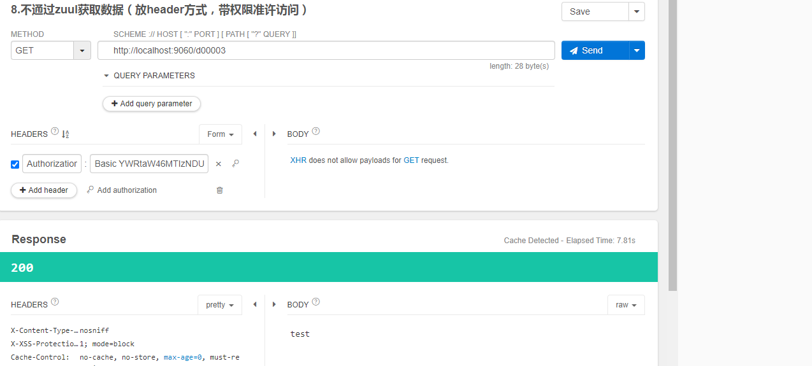


2. 携带access_token参数方式,

```shell
http://localhost:9060/d00002?access_token=XXX
```

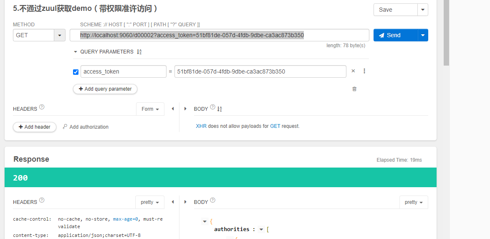

针对zuul访问特殊说明：

https://www.jianshu.com/p/6dd03375224d ， 解答了我自身的疑问，如果不使用zuul的security.oauth2.resource的配置去处理，则需要使用代码的方式进行token的验证。

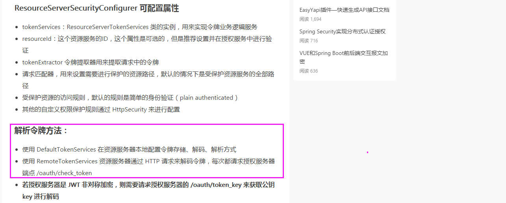

~~~shell
# 针对资源的直接使用http的处理请求方式， 重新userDetailsService接口，进行资源的权限认证。
# mss-oauth 是注册到nacos中的服务名称，需要获取用户Authentication的信息
# 可以自定义oauth2的资源服务器进行验证处理， 这块如果不放开，就需要自己完善UserDetailsService接口，未验证 ????
security:
  oauth2:
    resource:
      #      user-info-uri:  http://mss-oauth/user   # 要获取请求令牌的身份验证，在mss-oauth服务器中会调用/user请求，可以打断点，每次都会重复请求。
      user-info-uri:  http://mss-oauth:9030/user  # 可以使用nginx负载，也可以直接使用上面的，还可以直接使用某一个服务的接口调用, 使用127.0.0.1:9030无效,必须使用服务名称才可以，否则会域名无法解析的错误。
      prefer-token-info: false
      loadBalanced: true
~~~

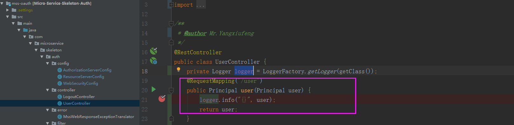

测试步骤：

1. 使用grant_type=password的进行登录认证请求

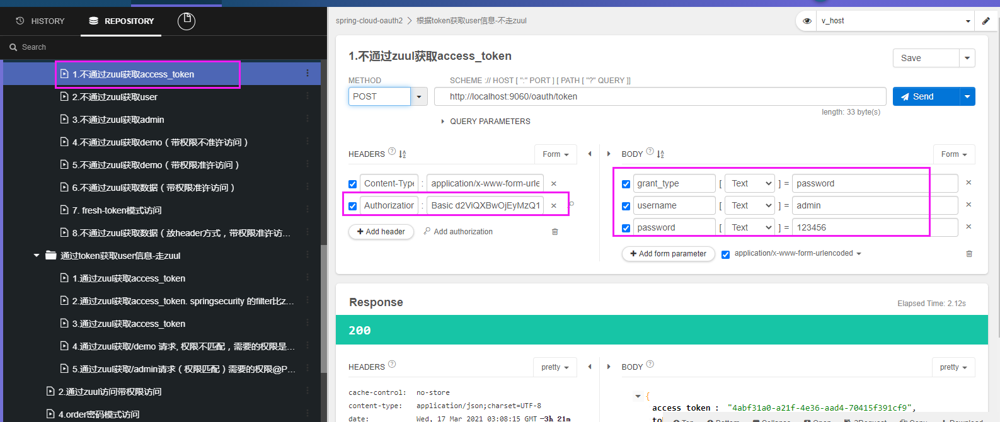

2.携带access_token进行接口的访问

> 在访问接口的过程中，后端代码可以使用  @PreAuthorize("hasAuthority('query-demo')")  进行的权限判断及接口绑定，这个是针对写死的情况下，动态不能够调节权限的更改，可以采用mss-gateway的方式进行com.microservice.skeleton.gateway.service.PermissionService的接口去实现，权限的部分继承 extends ResourceServerConfigurerAdapter ， 然后public void configure(HttpSecurity http) 重写该方法。
>
> registry.anyRequest().access("@permissionService.hasPermission(request,authentication)");
>
> ~~~java
> @Override
>     public void configure(HttpSecurity http) throws Exception {
>         // 包括token的生成与刷新操作
>         http.authorizeRequests().antMatchers("/v2/api-docs","/oauth/token","/mss-oauth/oauth/token").permitAll();
>         ExpressionUrlAuthorizationConfigurer<HttpSecurity>.ExpressionInterceptUrlRegistry registry = http.authorizeRequests();
>         for (String au : AUTH_WHITELIST) {
>             http.authorizeRequests().antMatchers(au).permitAll();
>         }
>         http.authorizeRequests().anyRequest().authenticated();
>         registry.anyRequest().access("@permissionService.hasPermission(request,authentication)");
>     }
> ~~~


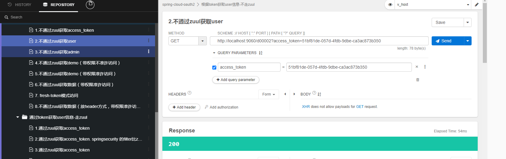


## 代码说明

mss-gateway: 网关， 网关做统一的权限验证，

如果在请求后端接口中，如果不携带参数access_token，那么这种用户就是匿名用户，ANONYMOUS

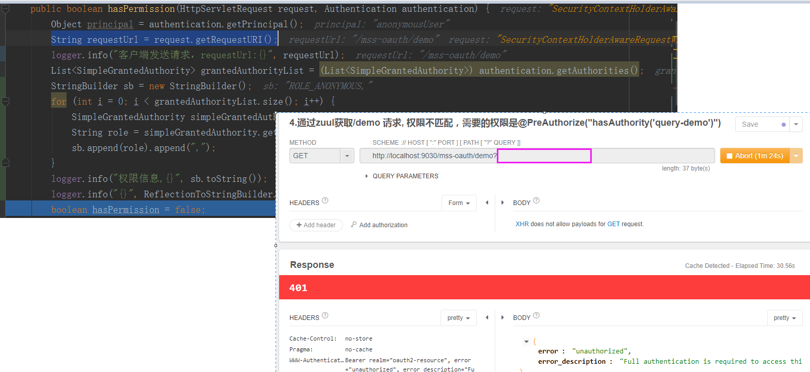

在mss-gateway中定义了资源认证规则， 对于"/uaa/**"的请求都不需要身份验证，所以访问http://localhost:9030/uaa/oauth/token的时候，就被放行了。

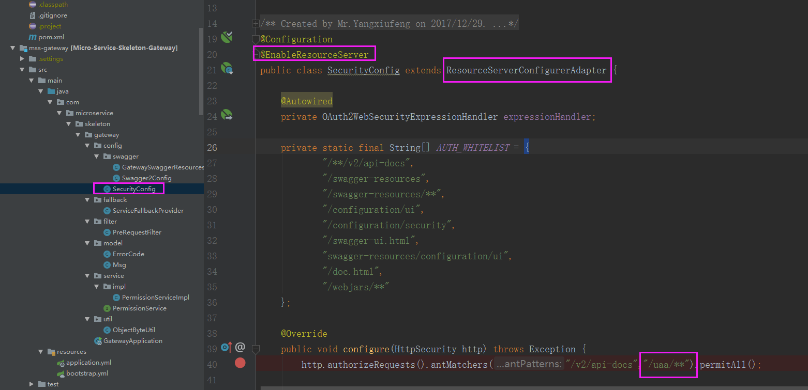


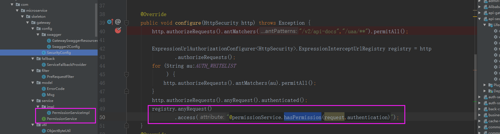

```java
public class SecurityConfig extends ResourceServerConfigurerAdapter {
```

在mss-oauth使用注册的服务是uaa，所以这块做了处理。

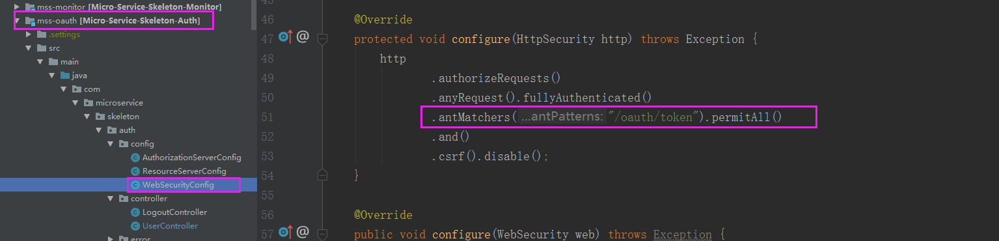

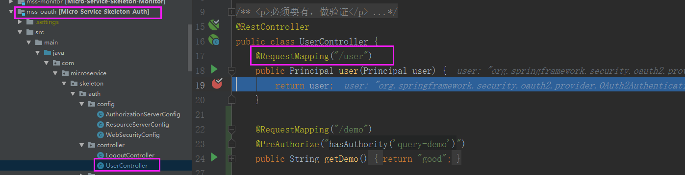

在zuul中配置权限访问这块非常重要，采用的是http的方式进行访问请求，获取Authentication的值，判断权限。

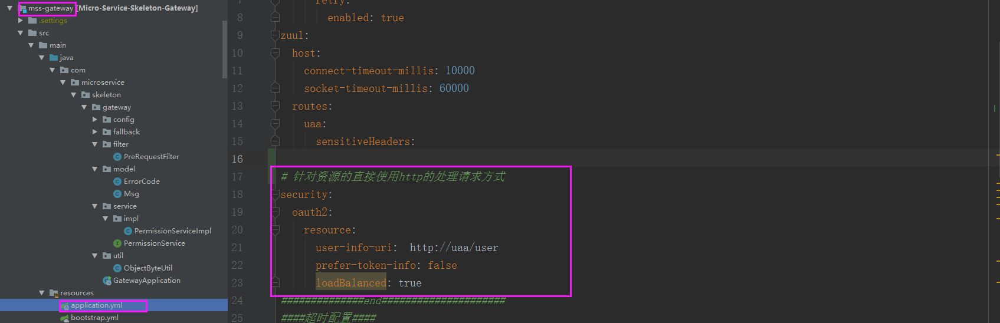


**改进点**：

1） 在实现userDetailsService中，现在是把所有的uri一次全部拿出到Authentication中，在去判断请求的uri是否跟Authentication的authority一致

2） 如果在registry.anyRequest().access("@permissionService.hasPermission(request,authentication)");  在permissionService实现类中去根据role去找一次uri，然后在匹配，这样也可以。

3） 不需要每次请求都要去请求一次，可以首先放在redis缓存中，然后在从缓存中拿，如果拿不到，在去请求接口进行数据获取。

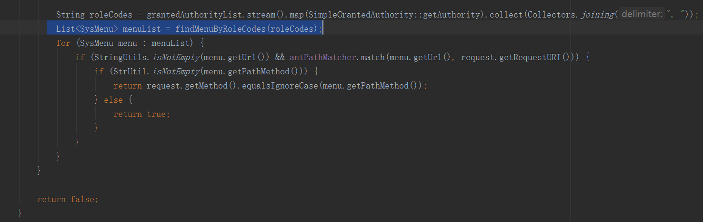


## 测试步骤

 1. 获取access_token

    点击小钥匙，在header中添加basic的clientid, secret的输入，会自动进行base64的加密过程。 在表`oauth_client_details`中定义了客户端的访问。

    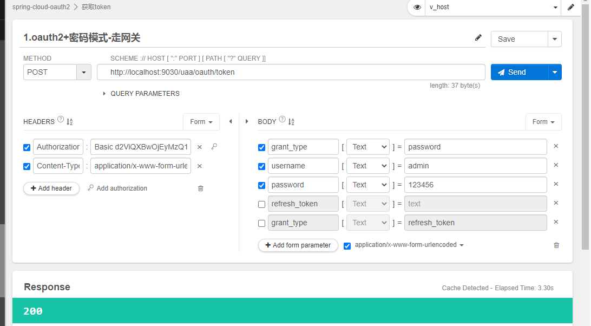


小钥匙的弹出界面

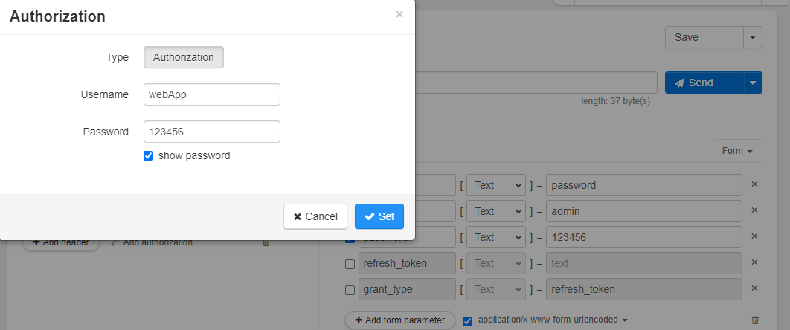

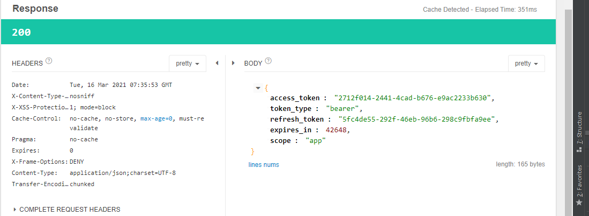


借鉴学习github: https://github.com/yangxiufeng666/Micro-Service-Skeleton/tree/v2.0

